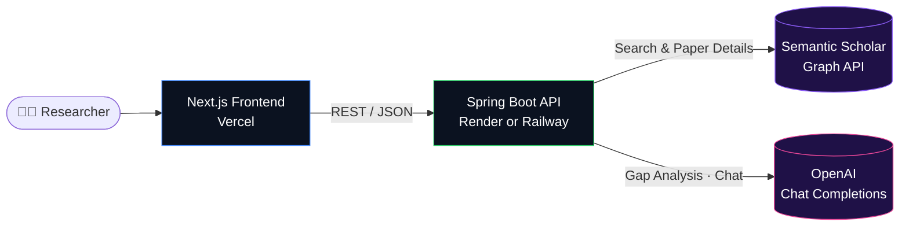

<div align="center">

# 🧠 Gaply

### **Your AI-powered research companion.**

Discover, understand, analyze, and converse with academic papers — all in one workspace.

[](https://nextjs.org/)
[](https://www.typescriptlang.org/)
[](https://tailwindcss.com/)
[](https://spring.io/projects/spring-boot)
[](https://openjdk.org/)
[](https://platform.openai.com/)
[](#-license)

</div>

---

## ✨ Overview

**Gaply** is an AI-native research workspace that takes a researcher from **"I have a vague topic"** to **"I understand the open problems"** in minutes — not days.

Search across millions of papers via Semantic Scholar, open any paper to read its abstract, then let the AI do the heavy lifting: summarize it in plain language, surface the gaps the authors didn't address, and answer follow-up questions grounded in the paper's content. Generate citations in APA, MLA, or Chicago with one click.

Built for the **Taylor & Francis Vibe Coding Hackathon** with AI-assisted development workflows and rapid prototyping — designed to feel like a polished, shippable product, not a hackathon demo.

---

## 🚀 Features

| | Feature | Description |
|---|---|---|
| 🔍 | **Live Paper Search** | Real-time semantic search across millions of papers via the Semantic Scholar Graph API. |
| 📄 | **Dynamic Paper Pages** | Click any result to open a dynamic detail page with title, abstract, authors, journal, and year — fetched live by paper ID. |
| 🔭 | **AI Research Gap Analysis** | Generate a plain-language summary, the paper's limitations, unexplored areas, and concrete future-research opportunities. |
| 💬 | **Chat with Paper** | Multi-turn AI chat grounded in the paper's title and abstract. Suggested questions, conversation memory, retry on error. |
| 📚 | **Citation Generator** | Auto-generate APA, MLA, and Chicago citations on the detail page with one-click copy-to-clipboard. |
| 🌗 | **Dark / Light Theme** | AI-native dark mode by default; persistent theme toggle with no FOUC on reload. |
| 🎨 | **Premium UI** | Gradient mesh backdrops, shimmer skeletons, staggered fade-in animations, hover-lift cards, and a consistent design system. |
| 📱 | **Responsive** | Polished from mobile to desktop with sensible breakpoints and accessible focus states. |

---

## 🏗️ Architecture



The backend is a clean three-layer Spring Boot app:

```
controller (HTTP) → service (domain logic) → external APIs (Semantic Scholar, OpenAI)
                          ↓
                    DTOs (validated with jakarta.validation)
```

The frontend uses the Next.js App Router with a thin server-component shell that hands off to client components for everything that needs hooks, state, or streaming UI.

---

## 🧱 Tech Stack

### Frontend

| Tool | Purpose |
|---|---|
| **Next.js 16** (App Router) | React framework with server + client components |
| **TypeScript 5** | End-to-end type safety |
| **Tailwind CSS 3** | Utility-first styling + design tokens |
| **shadcn/ui** | Accessible Radix-based primitives |
| **lucide-react** | Icon set |

### Backend

| Tool | Purpose |
|---|---|
| **Spring Boot 3.5** | REST framework |
| **Java 17** | Runtime |
| **Maven** | Build & dependency management |
| **Lombok** | Boilerplate-free DTOs and services |
| **Jakarta Validation** | Request validation (`@Valid`, `@NotBlank`, etc.) |
| **Jackson** | JSON ↔ Java mapping |
| **RestTemplate** | Outbound HTTP to Semantic Scholar & OpenAI |

### AI & External APIs

| Service | Use |
|---|---|
| **OpenAI Chat Completions** | Research gap analysis & chat with paper |
| **Semantic Scholar Graph API** | Paper search & detail lookup |

---

## ⚡ Quickstart

### Prerequisites

- **Node.js** ≥ 18.18
- **Java** 17 (JDK)
- An **OpenAI API key** (for AI features) — [get one here](https://platform.openai.com/api-keys)

### 1 · Configure environment

Create `backend/.env` (or just export the variable in your shell):

```bash
# backend/.env
OPENAI_API_KEY=sk-your-openai-key-here
```

Create `frontend/.env.local`:

```bash
# frontend/.env.local
NEXT_PUBLIC_API_BASE_URL=http://localhost:8080
```

### 2 · Run the backend (port 8080)

```bash
cd backend
export OPENAI_API_KEY=sk-...   # or rely on backend/.env
./mvnw spring-boot:run
```

> 💡 On Windows: `mvnw.cmd spring-boot:run`

### 3 · Run the frontend (port 3000)

```bash
cd frontend
npm install
npm run dev
```

### 4 · Open the app

Visit **[http://localhost:3000](http://localhost:3000)** and search for a topic like `transformers` or `protein folding`.

---

## 🔐 Environment Variables

### Backend (`application.properties` or env vars)

| Variable | Required | Default | Description |
|---|---|---|---|
| `OPENAI_API_KEY` | ✅ | — | Used for research gap analysis and chat with paper |
| `gaply.openai.model` | ❌ | `gpt-4o-mini` | OpenAI model name |
| `gaply.openai.temperature` | ❌ | `0.4` | Sampling temperature |
| `gaply.openai.base-url` | ❌ | `https://api.openai.com/v1` | Override for proxies / Azure OpenAI |
| `gaply.semantic-scholar.base-url` | ❌ | `https://api.semanticscholar.org/graph/v1` | Override if using a mirror |
| `gaply.semantic-scholar.search-limit` | ❌ | `10` | Max results per search |
| `gaply.cors.allowed-origins` | ❌ | `http://localhost:3000` | Comma-separated list of allowed origins |

### Frontend (`.env.local`)

| Variable | Required | Default | Description |
|---|---|---|---|
| `NEXT_PUBLIC_API_BASE_URL` | ❌ | `http://localhost:8080` | Backend base URL (override in production) |

### Sample `.env` files

```bash
# backend/.env
OPENAI_API_KEY=sk-proj-xxxxxxxxxxxxxxxxxxxxxxxx
# Optional overrides
# gaply.openai.model=gpt-4o-mini
# gaply.cors.allowed-origins=http://localhost:3000,https://gaply.vercel.app
```

```bash
# frontend/.env.local
NEXT_PUBLIC_API_BASE_URL=http://localhost:8080
```

---

## 🛰️ API Reference

All endpoints are JSON over HTTP, prefixed with `/api`.

### Papers

| Method | Endpoint | Description |
|---|---|---|
| `GET` | `/api/papers/search?q={query}` | Live search via Semantic Scholar |
| `GET` | `/api/papers/external/{paperId}` | Fetch a single paper by Semantic Scholar `paperId` |

### AI

| Method | Endpoint | Description |
|---|---|---|
| `POST` | `/api/ai/research-gap` | Body `{ title, abstract }` → structured insights |
| `POST` | `/api/ai/chat` | Body `{ title, abstract, question, history? }` → grounded answer |

### Citations

| Method | Endpoint | Description |
|---|---|---|
| `POST` | `/api/citations/generate` | Body `{ title, authors[], year, journal?, doi? }` → `{ apa, mla, chicago }` |

#### Example — Research Gap Analysis

```bash
curl -X POST http://localhost:8080/api/ai/research-gap \
  -H "Content-Type: application/json" \
  -d '{
    "title": "Attention Is All You Need",
    "abstract": "The dominant sequence transduction models..."
  }'
```

```json
{
  "simplifiedSummary": "Introduces the Transformer, a sequence model based entirely on attention...",
  "limitations": ["Quadratic complexity in sequence length", "..."],
  "unexploredAreas": ["Multimodal extensions", "..."],
  "futureOpportunities": ["Sparse attention variants", "..."]
}
```

#### Example — Citations

```bash
curl -X POST http://localhost:8080/api/citations/generate \
  -H "Content-Type: application/json" \
  -d '{
    "title": "Attention Is All You Need",
    "authors": ["Ashish Vaswani","Noam Shazeer"],
    "year": 2017,
    "journal": "NeurIPS",
    "doi": "10.48550/arXiv.1706.03762"
  }'
```

---

## 📂 Folder Structure

```
gaply/
├── backend/
│   ├── pom.xml
│   ├── mvnw / mvnw.cmd                       # Maven wrapper
│   └── src/main/
│       ├── java/com/gaply/backend/
│       │   ├── BackendApplication.java
│       │   ├── config/                       # CORS, RestTemplate beans
│       │   ├── controller/                   # @RestController layer
│       │   │   ├── PaperController.java      # /api/papers/*
│       │   │   ├── AiController.java         # /api/ai/*
│       │   │   └── CitationController.java   # /api/citations/*
│       │   ├── service/                      # Domain logic
│       │   │   ├── SemanticScholarService.java
│       │   │   ├── OpenAiService.java        # reusable LLM client
│       │   │   ├── ResearchGapService.java
│       │   │   ├── PaperChatService.java
│       │   │   └── CitationService.java
│       │   └── dto/                          # Request/response DTOs
│       └── resources/
│           └── application.properties
│
├── frontend/
│   ├── app/                                  # Next.js App Router
│   │   ├── layout.tsx                        # Root layout + theme bootstrap
│   │   ├── page.tsx                          # Landing
│   │   ├── search/page.tsx                   # /search
│   │   └── paper/[id]/page.tsx               # /paper/:id (dynamic)
│   ├── components/
│   │   ├── ui/                               # shadcn primitives
│   │   ├── Hero.tsx
│   │   ├── Navbar.tsx
│   │   ├── ThemeToggle.tsx
│   │   ├── SearchBar.tsx
│   │   ├── SearchResults.tsx
│   │   ├── PaperDetail.tsx
│   │   ├── PaperChat.tsx
│   │   ├── CitationsPanel.tsx
│   │   └── ResearchGapAnalysisPanel.tsx
│   ├── lib/
│   │   └── api.ts                            # Typed API client
│   ├── types/
│   │   └── index.ts
│   ├── tailwind.config.ts
│   └── package.json
│
└── README.md
```

---

## ☁️ Deployment

### Frontend → **Vercel**

1. Push the repo to GitHub.
2. Import the project on [vercel.com](https://vercel.com), pointing the **Root Directory** to `frontend/`.
3. Add environment variable:
   ```
   NEXT_PUBLIC_API_BASE_URL = https://<your-backend>.onrender.com
   ```
4. Deploy. Vercel auto-detects Next.js and ships in seconds.

### Backend → **Render** (or Railway)

**Render:**

1. New → **Web Service** → connect repo.
2. **Root Directory:** `backend/`
3. **Build Command:** `./mvnw clean package -DskipTests`
4. **Start Command:** `java -jar target/backend-0.0.1-SNAPSHOT.jar`
5. Add environment variables:
   ```
   OPENAI_API_KEY = sk-...
   gaply.cors.allowed-origins = https://<your-app>.vercel.app
   ```

**Railway:** Same idea — choose Java template, set the same envs, deploy.

> ⚠️ Don't forget to add your deployed Vercel URL to `gaply.cors.allowed-origins`, or the browser will block API calls with a CORS error.

---

## 🛣️ Roadmap & Future Improvements

- [ ] **Authentication** — save reading lists, chat history, and citation libraries per user
- [ ] **PDF ingestion** — go beyond abstracts; chat with the full paper via embeddings
- [ ] **Comparative analysis** — pick 2–3 papers and let the AI compare contributions, methods, and findings
- [ ] **Streaming chat** — token-by-token streaming via Server-Sent Events for snappier UX
- [ ] **BibTeX export** + reference manager integrations (Zotero, Mendeley)
- [ ] **Caching layer** (Redis) to dedupe Semantic Scholar lookups and reduce latency
- [ ] **Observability** — structured logs, request tracing, OpenAI token-usage dashboard
- [ ] **i18n** — multi-language summaries and UI

---

## 👥 Authors

Built with ❤️ at the **Taylor & Francis Vibe Coding Hackathon**.

- **Khushi S. Shukla** — Full-stack development & AI integration · [Khushi.SShukla@taylorandfrancis.com](mailto:Khushi.SShukla@taylorandfrancis.com)

> Add additional teammates here if Gaply becomes a group submission.

---

## 🤝 Contributing

Contributions, issues, and feature requests are welcome!

1. Fork the repo
2. Create a feature branch (`git checkout -b feat/amazing-feature`)
3. Commit your changes (`git commit -m "feat: add amazing feature"`)
4. Push to the branch (`git push origin feat/amazing-feature`)
5. Open a Pull Request

For larger changes, please open an issue first to discuss what you'd like to change.

---

## 🙏 Acknowledgements

- [**Semantic Scholar**](https://www.semanticscholar.org/) — the open Graph API that powers paper search
- [**OpenAI**](https://openai.com/) — the LLM behind research gap analysis and chat
- [**shadcn/ui**](https://ui.shadcn.com/) — the design-system foundation
- [**Radix UI**](https://www.radix-ui.com/) & [**Lucide**](https://lucide.dev/) — accessible primitives and icons
- [**Spring Boot**](https://spring.io/projects/spring-boot) and the [**Next.js**](https://nextjs.org/) teams — for genuinely great DX
- **Taylor & Francis** — for hosting the Vibe Coding Hackathon and championing AI-assisted development

---

## 📄 License

This project is licensed under the **MIT License** — see the [LICENSE](LICENSE) file for details.

---

<div align="center">

Made with ✨ AI-assisted workflows · Designed to feel premium · Built to ship.

</div>
# Gaply
